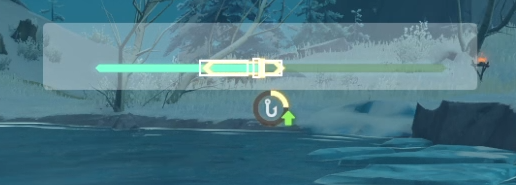

・[English](README.en.md) ・[中文](README.md) ・[日本語](README.jp.md)

# 🐟 Genshin Fishing Toy

> Genshin Fishing Toy [(Original Repository)](https://github.com/babalae/genshin-fishing-toy)

PC Genshin Impact auto fishing machine (Supports different game window sizes).

`"You just need to be responsible for the rod swing, and then all will be handled!"`

The simplest automatic fishing machine has its own GUI. Select the fishing box and start fishing. It is easy to use and hands free.

* Work with visual recognition.
* Delay 0~1s to auto lift the rod after the fish is hooked.

## ScreenShot

## Usage

1. First, move the jigging region to select the recognition region, and you also can resize the region. Just frame the fishing progress bar.  Don't frame the fishing progress circle below.

2. After confirming that the region position is correct, you can start auto fishing (Shortcut<kbd>F11</kbd>).

> - After the rod is thrown, just waiting for the fish to hook up. The program will auto control mouse according to the image recognition results and complete the fishing progress.
>
> - If you can't auto simulate the key, please try to add this program to the anti-virus software white list, or turn off anti-virus software firstly.

## FAQs
- If you are not fishing, you'd better stop the fishing function.
- If the Auto Lifting does not work, please try to increase the height of the fishing region frame.
- When the setup can't be installed. Please ensure that your system has installed the Microsoft Store. The setup depends on the store architecture (MSIX).

- Runtime environment isnet6.0-windows10.0.18362.0.

