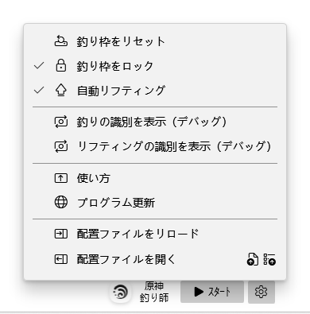

・[English](README.en.md) ・[中文](README.md) ・[日本語](README.jp.md)

# 🐟原神釣り師

> Genshin Fishing Toy [(元のリポジトリ)](https://github.com/babalae/genshin-fishing-toy)

PC版の原神自動釣りマシン（ゲームウィンドウサイズ別対応）。

「竿を振るだけで、あとは任せときぃ！」

最も簡単な自動釣魚機を操作し、釣り枠を選択してから釣りをスタートし、簡単で使いやすく。

* 視覚識別による自動操作。
* 魚がヒットしてから0~1sの遅延後に自動的に竿をリフティング。

## スクショ

## 使い方

1. まずは半透明長方形の釣り枠を移動して識別区域を囲むこと、釣り枠のサイズは調整できる、釣りのプログレスバーを枠に入れるだけでいいので、 下の丸い釣りプログレスを枠に入れないこと。
2. 釣り枠が正しい位置を囲んだ後、「スタート」してください（ショートカット<kbd>F11</kbd>）。

> - 魚竿を振った後、魚が釣れるのを待つだけ、プログラムは自動的に画像識別に基づいて対応、マウスを任せて釣りを行う。
>
> - もし正常にキーボードなどのシミュレーションが出来ない場合は、本プログラムをアンチウィルスソフトにホワイトリストに追加し、もしくはアンチウィルスソフトを終了後にお使いください。

## FAQs
- 釣りをしていない時は釣り機能をストップしたほうがいいのである。
- 自動リフティングができない場合は釣り枠の高さを上げてみてください。
- もしセットアップがインストールできない場合は、システムにアプリストアが実装されているかどうかをご確認ください。セットアップはアプリストアに依存している (MSIX)。
- 実行環境はnet6.0-windows10.0.18362.0。

