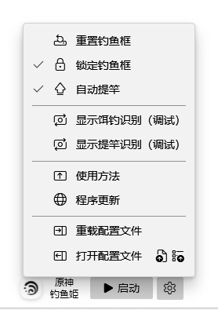

・[English](README.en.md) ・[中文](README.md) ・[日本語](README.jp.md)

# 🐟原神钓鱼姬

> Genshin Fishing Toy [（原始仓库）](https://github.com/babalae/genshin-fishing-toy)

PC原神自动钓鱼机（支持不同游戏窗口大小）。

『你只需负责甩竿，后面的放着我来！』

操作最简单的自动钓鱼机，选钓鱼框后启动钓鱼，简单易用，解放双手。

- [x] 采用视觉识别。
- [x] 鱼儿上钩后延迟0~1s自动提竿。

## 程序界面

## 使用方法

1. 首先移动半透明矩形钓鱼框选择识别范围，钓鱼框可调整大小，只需要框住钓鱼进度条就可以了， 不要框住下方的钓鱼总进度圈 。

2. 确认选框位置正确后，就直接启动进行自动钓鱼啦（快捷键<kbd>F11</kbd>）。

> 甩竿后直接等待鱼儿上钩即可，程序会自动根据当前图像识别的结果发送对应鼠标操作，自动化提竿、完成钓鱼进度。

## 常见问题
- 如果不在钓鱼的时候最好还是停止钓鱼功能。
- 若安装包无法安装，请确保你的系统已安装应用商店，安装包依赖商店架构 (MSIX)。

- 运行环境是net6.0-windows10.0.18362.0。

